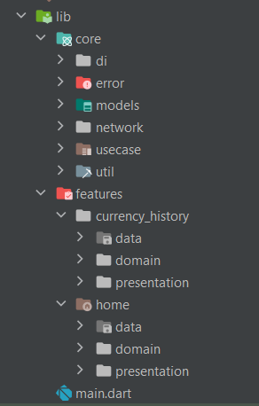

# currency

This project is powered by Flutter version **3.3.4**, Dart version **2.18.2** and DevTools version 2.15.0.

To select and install a specific version of flutter, we recommend using FVM: [fvm.app](https://fvm.app)

Bloc ([flutter_bloc](https://pub.dev/packages/flutter_bloc)) is used as an approach to state management, more precisely Cubit over Bloc from the same package. Bloc/Cubit handles `Events` and changes `States`. Screens and Widgtes subscribe to Bloc changes and send events (for Cubit, this is a direct method call).


The main packages used in the project:

```yaml
 get_it: ^7.2.0
 flutter_bloc: ^8.1.1
 bloc: ^8.1.0
 equatable: ^2.0.5
 shared_preferences: ^2.0.15
 dio: ^4.0.6
 dartz: ^0.10.1
 connectivity_plus: ^2.3.9
 lottie: ^1.4.3
 flutter_svg: ^1.1.5
 intl: ^0.17.0
 syncfusion_flutter_charts: ^20.3.48
 shimmer: ^2.0.0
```

### Table of Contents
1. [How to build & run](#build&run)
2. [Project structure](#structure)
3. [Download APK](#apk)
4. [Watch a video](#video)
5. [Screenshots](#screenshots)

## How to build & run <a name="build&run"></a>

The minimum required set of commands

```bash
- flutter clean # to clean the project
- flutter pub get # to get dependencies
```

To build and run the project, you can use `Android Studio` or `Visual Studio Code` with Flutter/Dart plugins (`Dart`, `Flutter`), then the commands above will be executed automatically when building and running.


To build from console:

```bash
 flutter build web --web-renderer html --release
```

You can assemble the flutter part separately and run the application from native projects

To run from console:

```bash
flutter run -d chrome --web-renderer html
```

``lib/main.dart`` - this is the main launch point of the project

## Project structure <a name="structure"></a>




|   |   |
|---|---|
|*main.dart*|The entry point to the application. Here is the initialization of Firebase Core, registration of services in Inject and registration of common Blocs that are used throughout the application.|
|*features/*|Application main pages (features).|
|---|---|
|*core/di*|Application Dependency injection directory.|
|*core/error*|Handling all errors and exceptions with custom logic.|
|*core/models*|Model classes used in the application.|
|*core/network*|Application network classes (remote - local).|
|*core/util*|Application-wide components and base class extensions.|
|---|---|
|*core/util/cubit*|`Bloc` used in the application.|
|---|---|

## Download Apk <a name="apk"></a>
<a href="https://drive.google.com/file/d/1BX_5bEHEQPA_pTEeKcAq_g884Sf31Y1u/view?usp=sharing" height="100"></a>

## Watch a video <a name="video"></a>

<a href="https://www.youtube.com/watch?v=hCIijq37rh0&ab_channel=AbdElRahmanmohamedFouad" target="_blank"></a>


### Screenshots <a name="screenshots"></a>

Some screenshots of the application:


